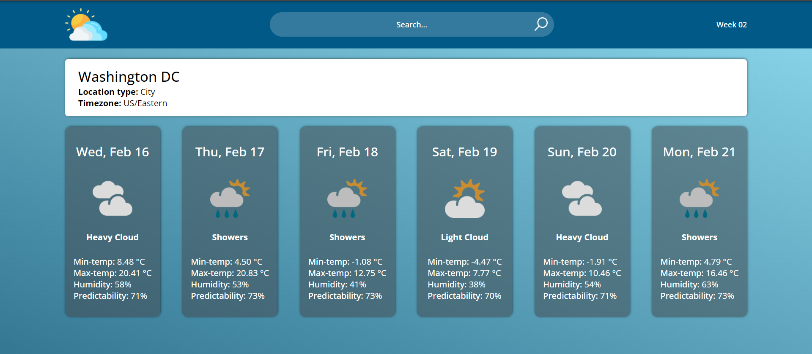
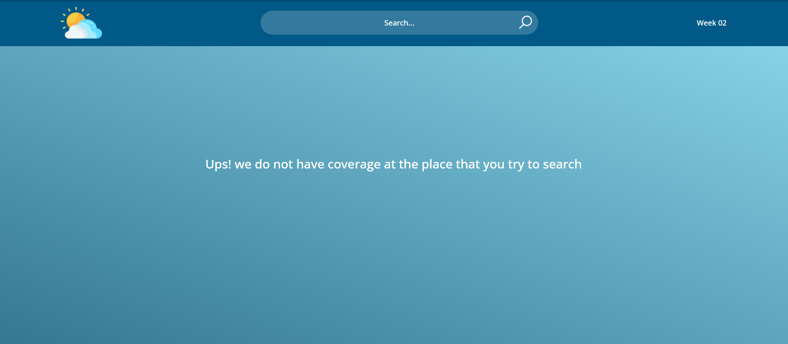
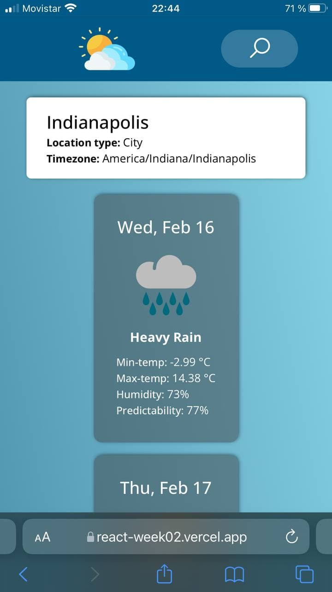
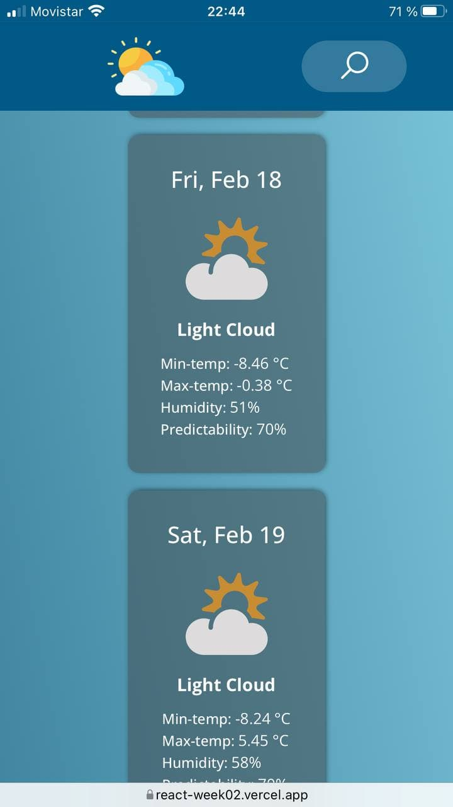

# 
 Week 02 - Wheather App 

### Link : [https://react-week02.vercel.app/](https://react-week02.vercel.app/)

## What is about?

#### The Weather App help us to see how is the weather in an specific location showing us the current weather and the weather of the coming 5 days, also each location shows a detailed information about the minimum and maximum temperature, the percentage of humidity and predictability. All this information is powered by [https://www.metaweather.com/api/](https://www.metaweather.com/api/) .

## How I use the App?

#### In order to search an specific location you have two options:

- **Clicking a suggested location:** while you are typing at the search bar there are going to be locations suggested you can view the weather of a suggested location just clicking on it.
- **Clicking at the search icon:** when you finish to type the location that you want to view you can click on the search icon and then the application will show you the information of the location if it is supported, if it is not supported a message will appear telling you that we do not have information of that location.

## UI Desing

#### _Desktop desing:_

#### _Phone desing:_

